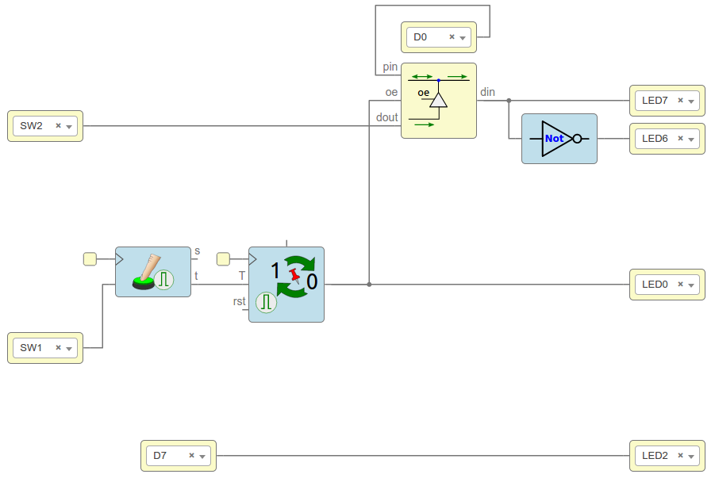

# Understand inout pin on ice40hx1k FPGA

In this example I use an Icezum Alhambra and a jumper wire.

With `sw1` we will toggle in/out mode. We will see the selected
mode on `Led0`. InOut port is connected to pin `D0`.

## Circuit

The circuit is designed in IceStudio. The file is available in the icestudio folder of this project.

## Input Mode

Press `sw1` until `Led0` is Off, `D0` will be in `Input` mode.

Connect a wire jumper to `D0`, and try to connect the other end to either groud or Vcc. You should observe how `Led7` shows the connected value and `Led6` shows the opposite.

## Output Mode

Press `sw1` until `Led0` is On, `D0` will now be in `Output` mode.

- Connect the wire jumper from `D0` to `D7`
- `D7` is itself connected to `Led2`
- `D0` is driven by `sw2` 

Try to press/release `sw2` and observe how `Led2` is showing the same signal.

## Further information

- [CT.3: Pines de Entrada Salida · Obijuan/Cuadernos-tecnicos-FPGAs-libres Wiki](https://github.com/Obijuan/Cuadernos-tecnicos-FPGAs-libres/wiki/CT.3:-Pines-de-Entrada-Salida#bloque-inout-right)
- [tristate inout example? - Google Groups](https://groups.google.com/forum/#!topic/fpga-wars-explorando-el-lado-libre/GBBzA6eF0KA)
- [Inout pins and high-Z - Troubleshooting Help - TinyFPGA](https://discourse.tinyfpga.com/t/inout-pins-and-high-z/158)
